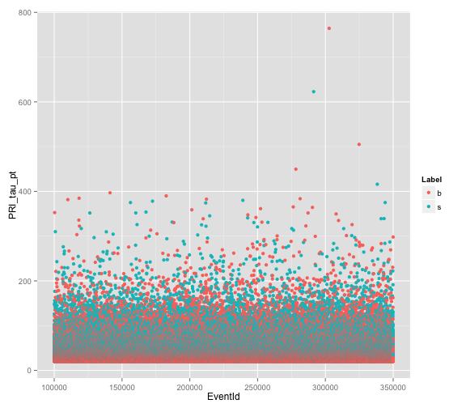
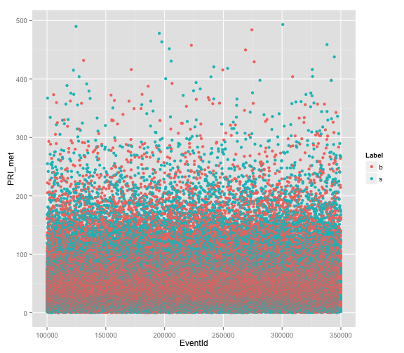
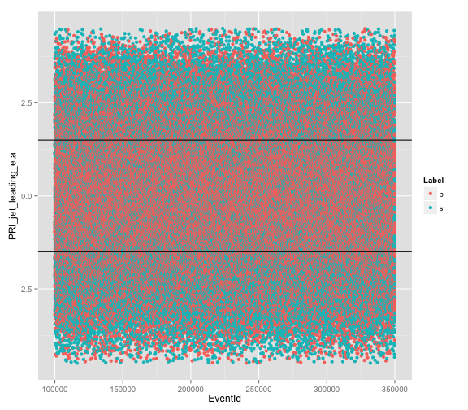
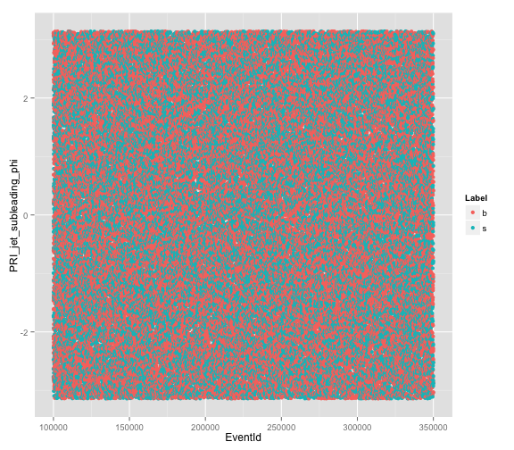
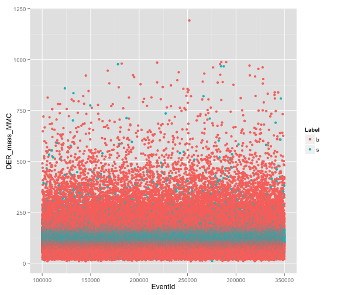
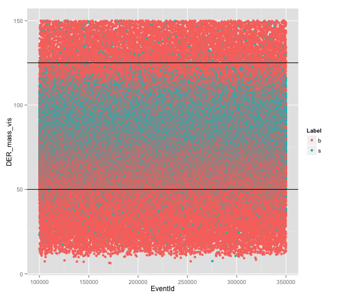

Higgs Boson Machine Learning Challenge
========================================================

The goal of this challenge is to identify which simulated ATLAS experiment proton-proton collision
observations contain evidence of boson pairs ("signal"), and which do not ("background"). 

The challenge is [hosted by Kaggle](http://www.kaggle.com/c/higgs-boson) and provided by [The Atlas Experiment](http://atlas.ch/).  Technical details were found in the [Laboratoire de l’Accélerateur Linéaire](http://higgsml.lal.in2p3.fr/) technical documentation [PDF](http://higgsml.lal.in2p3.fr/files/2014/04/documentation_v1.5.pdf). Attempts at summarizing these are my own, and may be imperfect (or 
completely off - I'm not a particle physicist!) [Pull requests to correct these](https://github.com/shannonrush/Contests/blob/master/HiggsBoson/Summary.Rmd) are welcome.

# The Data

Provided were a training set of 250,000 observations and a test set of 500,000 observations.
Unusable or unknown quantities are reported as -999.0.

The variables include 17 "primitive" quantities and 13 "derived" quantities. Also included
is the EventId identifying the observation. The training set also includes the goal label (b or s)
and a "Weight" metric not to be used in classification. For this reason I've stripped it out 
of the training set and saved a new CSV as processed_train.csv

## The Variables

```r
train <- read.csv("data/processed/processed_train.csv")
names(train)
```

```
##  [1] "EventId"                     "DER_mass_MMC"               
##  [3] "DER_mass_transverse_met_lep" "DER_mass_vis"               
##  [5] "DER_pt_h"                    "DER_deltaeta_jet_jet"       
##  [7] "DER_mass_jet_jet"            "DER_prodeta_jet_jet"        
##  [9] "DER_deltar_tau_lep"          "DER_pt_tot"                 
## [11] "DER_sum_pt"                  "DER_pt_ratio_lep_tau"       
## [13] "DER_met_phi_centrality"      "DER_lep_eta_centrality"     
## [15] "PRI_tau_pt"                  "PRI_tau_eta"                
## [17] "PRI_tau_phi"                 "PRI_lep_pt"                 
## [19] "PRI_lep_eta"                 "PRI_lep_phi"                
## [21] "PRI_met"                     "PRI_met_phi"                
## [23] "PRI_met_sumet"               "PRI_jet_num"                
## [25] "PRI_jet_leading_pt"          "PRI_jet_leading_eta"        
## [27] "PRI_jet_leading_phi"         "PRI_jet_subleading_pt"      
## [29] "PRI_jet_subleading_eta"      "PRI_jet_subleading_phi"     
## [31] "PRI_jet_all_pt"              "Label"
```

```r
signal <- which(train$Label == "s")
```


```r
require(ggplot2)
```

```
## Loading required package: ggplot2
```


```r
CreatePlot <- function(data, v, yintercept = c()) {
    p <- ggplot(data, aes(x = EventId, y = data[, v], color = Label), environment = environment())
    l <- p + labs(y = v)
    if (length(yintercept) == 0) {
        print(l + geom_point())
    } else {
        print(l + geom_point() + geom_hline(yintercept = yintercept))
    }
}
```


### Primitive Variables

**PRI_tau_pt**

The transverse momentum $\sqrt{p^2_x+p^2_y}$, or the momentum perpendicular to the beam line, of the hadronic tau measured in GeV


```r
CreatePlot(train, "PRI_tau_pt")
```

 


```r
ptp <- train$PRI_tau_pt
summary(ptp)
```

```
##    Min. 1st Qu.  Median    Mean 3rd Qu.    Max. 
##    20.0    24.6    31.8    38.7    45.0   764.0
```

Most observations are < 175 GeV, let's replot on that subset

```r
ptp.175 <- subset(train, PRI_tau_pt < 175)
CreatePlot(ptp.175, "PRI_tau_pt")
```

 

It looks like the slower the transverse momentum, the more likely the observation is background noise. Let's replot for < 50

```r
ptp.50 <- subset(train, PRI_tau_pt < 50)
CreatePlot(ptp.50, "PRI_tau_pt")
```

 

**PRI_tau_eta**

The pseudorapidity η (the angle from the beam axis) of the hadronic tau.


```r
CreatePlot(train, "PRI_tau_eta")
```

 

It looks like a higher quantity of signal observations exist within -1.5 to 1.5 than outside this range.

```r
signal.obs <- subset(train, Label == "s", select = PRI_tau_eta)
# quantity signal in range -1.5 to 1.5
in.range <- subset(signal.obs, PRI_tau_eta >= -1.5 & PRI_tau_eta <= 1.5)
nrow(in.range)/nrow(signal.obs)
```

```
## [1] 0.7974
```

Almost 80% of signal observations fall in the -1.5 to 1.5 range. Is it also more likely that an
observation outside of this range is background?

```r
outside.range <- subset(train, PRI_tau_eta < -1.5 | PRI_tau_eta > 1.5, select = Label)
table(outside.range)
```

```
## outside.range
##     b     s 
## 49179 17355
```

```r
length(which(outside.range == "b"))/nrow(outside.range)
```

```
## [1] 0.7392
```

About 74% of observations outside the range -1.5 to 1.5 are background noise.

**PRI_tau_phi**

The azimuthal angle φ, from -pi to pi in the spherical coordinate system, of the hadronic tau 
around the beam axis.


```r
CreatePlot(train, "PRI_tau_phi")
```

 


```r
# all observations
summary(train$PRI_tau_phi)
```

```
##    Min. 1st Qu.  Median    Mean 3rd Qu.    Max. 
## -3.1400 -1.5800 -0.0330 -0.0082  1.5600  3.1400
```

```r
summary(train[signal, "PRI_tau_phi"])
```

```
##    Min. 1st Qu.  Median    Mean 3rd Qu.    Max. 
## -3.1400 -1.5800 -0.0590 -0.0192  1.5400  3.1400
```

```r
summary(train[-signal, "PRI_tau_phi"])
```

```
##    Min. 1st Qu.  Median    Mean 3rd Qu.    Max. 
## -3.1400 -1.5700 -0.0170 -0.0024  1.5800  3.1400
```

**PRI_lep_pt**

The transverse momentum $\sqrt{p^2_x+p^2_y}$, or the momentum perpendicular to the beam line, of the lepton (electron or muon) measured in GeV


```r
CreatePlot(train, "PRI_lep_pt")
```

 

Replotting to < 200

```r
plp.200 <- subset(train, PRI_lep_pt < 200)
CreatePlot(plp.200, "PRI_lep_pt")
```

 


```r
summary(train$PRI_lep_pt)
```

```
##    Min. 1st Qu.  Median    Mean 3rd Qu.    Max. 
##    26.0    32.4    40.5    46.7    53.4   560.0
```

**PRI_lep_eta**

The pseudorapidity η (the angle from the beam axis) of the lepton.


```r
CreatePlot(train, "PRI_lep_eta")
```

 

Just as with the pseudorapidity of the hadronic tau it appears the signal
clusters in the range of -1.5 to 1.5

```r
signal.obs <- subset(train, Label == "s", select = PRI_lep_eta)
# quantity signal in range -1.5 to 1.5
in.range <- subset(signal.obs, PRI_lep_eta >= -1.5 & PRI_lep_eta <= 1.5)
nrow(in.range)/nrow(signal.obs)
```

```
## [1] 0.7837
```

Aabout 78% of signal observations fall in the -1.5 to 1.5 range. 


```r
outside.range <- subset(train, PRI_lep_eta < -1.5 | PRI_lep_eta > 1.5, select = Label)
table(outside.range)
```

```
## outside.range
##     b     s 
## 56096 18534
```

```r
length(which(outside.range == "b"))/nrow(outside.range)
```

```
## [1] 0.7517
```

About 75% of observations outside the range -1.5 to 1.5 are background noise.

**PRI_lep_phi**

The azimuthal angle φ, from -pi to pi in the spherical coordinate system, of the lepton 
around the beam axis.


```r
CreatePlot(train, "PRI_lep_phi")
```

 


```r
# all observations
summary(train$PRI_lep_phi)
```

```
##    Min. 1st Qu.  Median    Mean 3rd Qu.    Max. 
## -3.1400 -1.5200  0.0860  0.0435  1.6200  3.1400
```

```r
summary(train[signal, "PRI_lep_phi"])
```

```
##    Min. 1st Qu.  Median    Mean 3rd Qu.    Max. 
## -3.1400 -1.5000  0.1030  0.0539  1.6300  3.1400
```

```r
summary(train[-signal, "PRI_lep_phi"])
```

```
##    Min. 1st Qu.  Median    Mean 3rd Qu.    Max. 
## -3.1400 -1.5300  0.0760  0.0381  1.6100  3.1400
```

**PRI_met**
The missing transverse energy $\overrightarrow{E}^{miss}_T$ 


```r
CreatePlot(train, "PRI_met")
```

 


```r
summary(train$PRI_met)
```

```
##    Min. 1st Qu.  Median    Mean 3rd Qu.    Max. 
##     0.1    21.4    34.8    41.7    51.9  2840.0
```

```r
summary(train[signal, "PRI_met"])
```

```
##    Min. 1st Qu.  Median    Mean 3rd Qu.    Max. 
##     0.2    17.9    31.9    42.7    54.5  2840.0
```

```r
summary(train[-signal, "PRI_met"])
```

```
##    Min. 1st Qu.  Median    Mean 3rd Qu.    Max. 
##     0.1    23.3    35.9    41.2    51.0   951.0
```

That one outlier really makes this blurry...

```r
pm.500 <- subset(train, PRI_met < 500)
CreatePlot(pm.500, "PRI_met")
```

 


```r
pm.200 <- subset(train, PRI_met < 200)
CreatePlot(pm.200, "PRI_met")
```

 


```r
pm.100 <- subset(train, PRI_met < 100)
CreatePlot(pm.100, "PRI_met")
```

 

There appears to be a lot of signal clustered < 25

```r
under.25 <- subset(train[signal, ], PRI_met < 25)
nrow(under.25)/length(signal)
```

```
## [1] 0.3842
```

About 38% of the signal is < 25 

**PRI_met_phi**

The azimuth angle φ of the missing transverse energy.


```r
CreatePlot(train, "PRI_met_phi")
```

 


```r
summary(train$PRI_met_phi)
```

```
##    Min. 1st Qu.  Median    Mean 3rd Qu.    Max. 
## -3.1400 -1.5800 -0.0240 -0.0101  1.5600  3.1400
```

```r
summary(train[signal, "PRI_met_phi"])
```

```
##    Min. 1st Qu.  Median    Mean 3rd Qu.    Max. 
## -3.1400 -1.5500  0.0190  0.0086  1.5800  3.1400
```

```r
summary(train[-signal, "PRI_met_phi"])
```

```
##    Min. 1st Qu.  Median    Mean 3rd Qu.    Max. 
## -3.1400 -1.5800 -0.0440 -0.0199  1.5500  3.1400
```


**PRI_met_sumet**

The total transverse energy in the detector.

```r
CreatePlot(train, "PRI_met_sumet")
```

 


```r
summary(train$PRI_met_sumet)
```

```
##    Min. 1st Qu.  Median    Mean 3rd Qu.    Max. 
##    13.7   123.0   180.0   210.0   263.0  2000.0
```

```r
summary(train[signal, "PRI_met_sumet"])
```

```
##    Min. 1st Qu.  Median    Mean 3rd Qu.    Max. 
##    13.7   146.0   208.0   234.0   291.0  1390.0
```

```r
summary(train[-signal, "PRI_met_sumet"])
```

```
##    Min. 1st Qu.  Median    Mean 3rd Qu.    Max. 
##    18.5   114.0   166.0   197.0   246.0  2000.0
```


```r
pms.750 <- subset(train, PRI_met_sumet < 750)
CreatePlot(pms.750, "PRI_met_sumet")
```

 


```r
pms.300 <- subset(train, PRI_met_sumet < 300)
CreatePlot(pms.300, "PRI_met_sumet")
```

 


```r
pms.200 <- subset(train, PRI_met_sumet < 200)
CreatePlot(pms.200, "PRI_met_sumet")
```

 

**PRI_jet_num**

The number of jets (a narrow cone of hadrons and other particles produced by the 
hadronization of a quark or gluon)
http://en.wikipedia.org/wiki/Jet_(particle_physics)


```r
ggplot(data = train, aes(x = PRI_jet_num, fill = Label)) + geom_bar(position = position_dodge())
```

```
## stat_bin: binwidth defaulted to range/30. Use 'binwidth = x' to adjust this.
```

 

**PRI_jet_leading_pt** 
The transverse momentum $\sqrt{p^2_x+p^2_y}$ of the leading jet, that is the jet with
largest transverse momentum (undefined if PRI jet num = 0).


```r
CreatePlot(train, "PRI_jet_leading_pt")
```

 


```r
pjlp.na <- subset(train, PRI_jet_leading_pt == -999, select = Label)
table(pjlp.na)
```

```
## pjlp.na
##     b     s 
## 74421 25492
```

```r
length(which(pjlp.na == "b"))/nrow(pjlp.na)
```

```
## [1] 0.7449
```

75% of undefined are background.

```r
pjlp <- subset(train, PRI_jet_leading_pt != -999)
CreatePlot(pjlp, "PRI_jet_leading_pt")
```

 


```r
summary(pjlp$PRI_jet_leading_pt)
```

```
##    Min. 1st Qu.  Median    Mean 3rd Qu.    Max. 
##    30.0    44.4    65.6    84.8   103.0  1120.0
```

```r
pjlp.signal <- which(pjlp$Label == "s")
summary(pjlp[pjlp.signal, "PRI_jet_leading_pt"])
```

```
##    Min. 1st Qu.  Median    Mean 3rd Qu.    Max. 
##    30.0    50.1    74.4    92.9   114.0   738.0
```

```r
summary(pjlp[-pjlp.signal, "PRI_jet_leading_pt"])
```

```
##    Min. 1st Qu.  Median    Mean 3rd Qu.    Max. 
##    30.0    41.7    60.1    79.4    95.2  1120.0
```

**PRI_jet_leading_eta**

The pseudorapidity η of the leading jet (undefined if PRI jet num = 0).


```r
CreatePlot(train, "PRI_jet_leading_eta")
```

 


```r
pjle.na <- subset(train, PRI_jet_leading_eta == -999, select = Label)
table(pjle.na)
```

```
## pjle.na
##     b     s 
## 74421 25492
```

```r
length(which(pjle.na == "b"))/nrow(pjle.na)
```

```
## [1] 0.7449
```

74% of undefined are background.

```r
pjle <- subset(train, PRI_jet_leading_eta != -999)
CreatePlot(pjle, "PRI_jet_leading_eta", c(-1.5, 1.5))
```

 


```r
pjle.inrange <- which(pjle$PRI_jet_leading_eta >= -1.5 & pjle$PRI_jet_leading_eta <= 
    1.5)
table(pjle[pjle.inrange, "Label"])
```

```
## 
##     b     s 
## 55373 27680
```

```r
nrow(subset(pjle[pjle.inrange, ], Label == "b"))/length(pjle.inrange)
```

```
## [1] 0.6667
```

67% of defined observations in the -1.5 to 1.5 range are background

What percentange of defined observations outside the -1.5 to 1.5 range are signal?

```r
out.range <- subset(pjle, PRI_jet_leading_eta < -1.5 | PRI_jet_leading_eta > 
    1.5, select = "Label")
table(out.range)
```

```
## out.range
##     b     s 
## 34539 32495
```


```r
summary(pjle$PRI_jet_leading_eta)
```

```
##    Min. 1st Qu.  Median    Mean 3rd Qu.    Max. 
##  -4.500  -1.340   0.000  -0.003   1.340   4.500
```

```r
pjle.signal <- which(pjle$Label == "s")
summary(pjle[pjle.signal, "PRI_jet_leading_eta"])
```

```
##    Min. 1st Qu.  Median    Mean 3rd Qu.    Max. 
##  -4.500  -1.630  -0.005  -0.003   1.620   4.500
```

```r
summary(pjle[-pjle.signal, "PRI_jet_leading_eta"])
```

```
##    Min. 1st Qu.  Median    Mean 3rd Qu.    Max. 
##  -4.500  -1.170   0.002  -0.004   1.170   4.490
```

**PRI_jet_leading_phi**

The azimuth angle φ of the leading jet (undefined if PRI jet num = 0).


```r
CreatePlot(train, "PRI_jet_leading_phi")
```

 


```r
pjlphi.na <- subset(train, PRI_jet_leading_phi == -999, select = Label)
table(pjlphi.na)
```

```
## pjlphi.na
##     b     s 
## 74421 25492
```

```r
length(which(pjlphi.na == "b"))/nrow(pjlphi.na)
```

```
## [1] 0.7449
```

75% of undefined are background

```r
pjlphi <- subset(train, PRI_jet_leading_phi != -999)
CreatePlot(pjlphi, "PRI_jet_leading_phi")
```

 


```r
summary(pjlphi$PRI_jet_leading_phi)
```

```
##    Min. 1st Qu.  Median    Mean 3rd Qu.    Max. 
## -3.1400 -1.5800 -0.0330 -0.0124  1.5600  3.1400
```

```r
pjlphi.signal <- which(pjlphi$Label == "s")
summary(pjlphi[pjlphi.signal, "PRI_jet_leading_phi"])
```

```
##    Min. 1st Qu.  Median    Mean 3rd Qu.    Max. 
## -3.1400 -1.5900 -0.0360 -0.0129  1.5700  3.1400
```

```r
summary(pjlphi[-pjlphi.signal, "PRI_jet_leading_phi"])
```

```
##    Min. 1st Qu.  Median    Mean 3rd Qu.    Max. 
## -3.1400 -1.5800 -0.0310 -0.0121  1.5600  3.1400
```

**PRI_jet_subleading_pt**

The transverse momentum $\sqrt{p^2_x+p^2_y}$ of the second leading jet. 
 (undefined if PRI jet num ≤ 1).
 

```r
CreatePlot(train, "PRI_jet_subleading_pt")
```

 


```r
pjsp.na <- subset(train, PRI_jet_subleading_pt == -999, select = Label)
table(pjsp.na)
```

```
## pjsp.na
##      b      s 
## 124255  53202
```

```r
length(which(pjsp.na == "b"))/nrow(pjsp.na)
```

```
## [1] 0.7002
```

70% of undefined are background

```r
pjsp <- subset(train, PRI_jet_subleading_pt != -999)
CreatePlot(pjsp, "PRI_jet_subleading_pt")
```

 


```r
summary(pjsp$PRI_jet_subleading_pt)
```

```
##    Min. 1st Qu.  Median    Mean 3rd Qu.    Max. 
##    30.0    37.3    47.9    57.7    66.6   721.0
```

```r
pjsp.signal <- which(pjsp$Label == "s")
summary(pjsp[pjsp.signal, "PRI_jet_subleading_pt"])
```

```
##    Min. 1st Qu.  Median    Mean 3rd Qu.    Max. 
##    30.0    37.8    48.6    56.9    66.8   422.0
```

```r
summary(pjsp[-pjsp.signal, "PRI_jet_subleading_pt"])
```

```
##    Min. 1st Qu.  Median    Mean 3rd Qu.    Max. 
##    30.0    37.0    47.4    58.3    66.5   721.0
```

**PRI_jet_subleading_phi**

The azimuth angle φ of the subleading jet (undefined if PRI jet num ≤ 1).

```r
CreatePlot(train, "PRI_jet_subleading_phi")
```

 


```r
pjsphi.na <- subset(train, PRI_jet_subleading_phi == -999, select = Label)
table(pjsphi.na)
```

```
## pjsphi.na
##      b      s 
## 124255  53202
```

```r
length(which(pjsphi.na == "b"))/nrow(pjsphi.na)
```

```
## [1] 0.7002
```

70% of undefined are background

```r
pjsphi <- subset(train, PRI_jet_subleading_phi != -999)
CreatePlot(pjsphi, "PRI_jet_subleading_phi")
```

 


```r
summary(pjsphi$PRI_jet_subleading_phi)
```

```
##    Min. 1st Qu.  Median    Mean 3rd Qu.    Max. 
## -3.1400 -1.5800 -0.0020 -0.0016  1.5800  3.1400
```

```r
pjsphi.signal <- which(pjsphi$Label == "s")
summary(pjsphi[pjsphi.signal, "PRI_jet_subleading_phi"])
```

```
##    Min. 1st Qu.  Median    Mean 3rd Qu.    Max. 
## -3.1400 -1.5900 -0.0240 -0.0143  1.5600  3.1400
```

```r
summary(pjsphi[-pjsphi.signal, "PRI_jet_subleading_phi"])
```

```
##    Min. 1st Qu.  Median    Mean 3rd Qu.    Max. 
## -3.1400 -1.5700  0.0160  0.0087  1.5900  3.1400
```

**PRI_jet_all_pt** 

The scalar sum of the transverse momentum of all the jets.

```r
CreatePlot(train, "PRI_jet_all_pt")
```

 


```r
pjap.500 <- subset(train, PRI_jet_all_pt < 500)
CreatePlot(pjap.500, "PRI_jet_all_pt")
```

 


```r
pjap.300 <- subset(train, PRI_jet_all_pt < 300)
CreatePlot(pjap.300, "PRI_jet_all_pt")
```

 


```r
summary(train$PRI_jet_all_pt)
```

```
##    Min. 1st Qu.  Median    Mean 3rd Qu.    Max. 
##     0.0     0.0    40.5    73.1   110.0  1630.0
```

```r
summary(train[signal, "PRI_jet_all_pt"])
```

```
##    Min. 1st Qu.  Median    Mean 3rd Qu.    Max. 
##     0.0     0.0    68.0    91.3   139.0  1190.0
```

```r
summary(train[-signal, "PRI_jet_all_pt"])
```

```
##    Min. 1st Qu.  Median    Mean 3rd Qu.    Max. 
##     0.0     0.0    33.6    63.6    89.8  1630.0
```

### Derived Variables
**DER_mass_MMC**

The estimated mass of the Higgs boson candidate. May be undefined.

```r
CreatePlot(train, "DER_mass_MMC")
```

 


```r
dmm.na <- subset(train, DER_mass_MMC == -999, select = Label)
table(dmm.na)
```

```
## dmm.na
##     b     s 
## 35279  2835
```

```r
length(which(dmm.na == "b"))/nrow(dmm.na)
```

```
## [1] 0.9256
```

93% of undefined are background

```r
dmm <- subset(train, DER_mass_MMC != -999)
CreatePlot(dmm, "DER_mass_MMC")
```

 


```r
dmm.250 <- subset(dmm, DER_mass_MMC < 250)
CreatePlot(dmm.250, "DER_mass_MMC", c(75, 175))
```

 


```r
dmm.signal <- subset(dmm, Label == "s")
dmm.signal.inrange <- subset(dmm.signal, DER_mass_MMC >= 75 & DER_mass_MMC <= 
    175)
nrow(dmm.signal.inrange)/nrow(dmm.signal)
```

```
## [1] 0.9702
```

97% of defined signal observations lie in range 75 to 175

**DER_mass_transverse_met_lep**

The transverse mass between the missing transverse energy and the lepton.


```r
CreatePlot(train, "DER_mass_transverse_met_lep")
```

 


```r
dmtml.200 <- subset(train, DER_mass_transverse_met_lep < 200)
CreatePlot(dmtml.200, "DER_mass_transverse_met_lep")
```

 


```r
dmtml.150 <- subset(train, DER_mass_transverse_met_lep < 150)
CreatePlot(dmtml.150, "DER_mass_transverse_met_lep", 75)
```

 


```r
dmtml.signal.75 <- subset(train[signal, ], DER_mass_transverse_met_lep < 75)
nrow(dmtml.signal.75)/nrow(train[signal, ])
```

```
## [1] 0.9257
```

93% of all signal observations are < 75

```r
summary(train$DER_mass_transverse_met_lep)
```

```
##    Min. 1st Qu.  Median    Mean 3rd Qu.    Max. 
##     0.0    19.2    46.5    49.2    73.6   690.0
```

```r
summary(train[signal, "DER_mass_transverse_met_lep"])
```

```
##    Min. 1st Qu.  Median    Mean 3rd Qu.    Max. 
##     0.0    10.4    24.4    32.0    45.7   570.0
```

```r
summary(train[-signal, "DER_mass_transverse_met_lep"])
```

```
##    Min. 1st Qu.  Median    Mean 3rd Qu.    Max. 
##     0.0    31.4    60.8    58.2    80.2   690.0
```

**DER_mass_vis**

The total invariant mass ([total energy and momentum](http://en.wikipedia.org/wiki/Invariant_mass)) of the hadronic tau and the lepton.


```r
CreatePlot(train, "DER_mass_vis", 150)
```

 


```r
dmv.150 <- subset(train, DER_mass_vis < 150)
CreatePlot(dmv.150, "DER_mass_vis", c(50, 125))
```

 

What percentage of all signal are between 50 and 125?

```r
dmv.signal.inrange <- subset(train[signal, ], DER_mass_vis >= 50 & DER_mass_vis <= 
    125)
nrow(dmv.signal.inrange)/nrow(train[signal, ])
```

```
## [1] 0.9494
```

95% of all signal observations found in range 50 to 125

```r
summary(train$DER_mass_vis)
```

```
##    Min. 1st Qu.  Median    Mean 3rd Qu.    Max. 
##     6.3    59.4    73.8    81.2    92.3  1350.0
```

```r
summary(train[signal, "DER_mass_vis"])
```

```
##    Min. 1st Qu.  Median    Mean 3rd Qu.    Max. 
##     7.5    67.4    79.4    80.4    91.9   790.0
```

```r
summary(train[-signal, "DER_mass_vis"])
```

```
##    Min. 1st Qu.  Median    Mean 3rd Qu.    Max. 
##     6.3    55.5    69.7    81.6    92.7  1350.0
```

**DER_pt_h**

The modulus of the vector sum of the transverse momentum of the hadronic tau,
the lepton, and the missing transverse energy vector.


```r
CreatePlot(train, "DER_pt_h", 400)
```

 


```r
dph.400 <- subset(train, DER_pt_h < 400)
CreatePlot(dph.400, "DER_pt_h")
```

 


```r
dph.200 <- subset(train, DER_pt_h < 200)
CreatePlot(dph.200, "DER_pt_h", 50)
```

 


```r
dph.50 <- subset(train, DER_pt_h < 50)
CreatePlot(dph.50, "DER_pt_h")
```

 

What percentage of total signal > 50?

```r
dph.signal.inrange <- subset(train[signal, ], DER_pt_h > 50)
nrow(dph.signal.inrange)/nrow(train[signal, ])
```

```
## [1] 0.5299
```

53% of total signal found > 50

```r
summary(train$DER_pt_h)
```

```
##    Min. 1st Qu.  Median    Mean 3rd Qu.    Max. 
##     0.0    14.1    38.5    57.9    79.2  2830.0
```

```r
summary(train[signal, "DER_pt_h"])
```

```
##    Min. 1st Qu.  Median    Mean 3rd Qu.    Max. 
##     0.0    23.5    54.4    74.9   105.0  2830.0
```

```r
summary(train[-signal, "DER_pt_h"])
```

```
##    Min. 1st Qu.  Median    Mean 3rd Qu.    Max. 
##     0.0     8.4    32.9    49.0    65.7  1050.0
```

**DER_deltaeta_jet_jet**

The pseudorapidity separation (the angular separation)  between the two jets (undefined if
PRI jet num ≤ 1).


```r
CreatePlot(train, "DER_deltaeta_jet_jet")
```

 


```r
ddjj.na <- subset(train, DER_deltaeta_jet_jet == -999, select = Label)
table(ddjj.na)
```

```
## ddjj.na
##      b      s 
## 124255  53202
```

```r
length(which(ddjj.na == "b"))/nrow(ddjj.na)
```

```
## [1] 0.7002
```

70% of undefined observations are background

```r
ddjj <- subset(train, DER_deltaeta_jet_jet != -999)
CreatePlot(ddjj, "DER_deltaeta_jet_jet")
```

 


```r
summary(ddjj$DER_deltaeta_jet_jet)
```

```
##    Min. 1st Qu.  Median    Mean 3rd Qu.    Max. 
##   0.000   0.883   2.110   2.400   3.690   8.500
```

```r
ddjj.signal <- which(ddjj$Label == "s")
summary(ddjj[ddjj.signal, "DER_deltaeta_jet_jet"])
```

```
##    Min. 1st Qu.  Median    Mean 3rd Qu.    Max. 
##    0.00    1.19    3.15    3.04    4.56    8.50
```

```r
summary(ddjj[-ddjj.signal, "DER_deltaeta_jet_jet"])
```

```
##    Min. 1st Qu.  Median    Mean 3rd Qu.    Max. 
##   0.000   0.758   1.620   1.890   2.750   7.890
```

**DER_mass_jet_jet**

The invariant mass of the two jets (undefined if PRI jet num ≤ 1).

```r
CreatePlot(train, "DER_mass_jet_jet")
```

 


```r
dmjj.na <- subset(train, DER_mass_jet_jet == -999, select = Label)
table(dmjj.na)
```

```
## dmjj.na
##      b      s 
## 124255  53202
```

```r
length(which(dmjj.na == "b"))/nrow(dmjj.na)
```

```
## [1] 0.7002
```

70% of undefined observations are background

```r
dmjj <- subset(train, DER_mass_jet_jet != -999)
CreatePlot(dmjj, "DER_mass_jet_jet")
```

 


```r
summary(dmjj$DER_mass_jet_jet)
```

```
##    Min. 1st Qu.  Median    Mean 3rd Qu.    Max. 
##      14     112     226     372     478    4970
```

```r
dmjj.signal <- which(dmjj$Label == "s")
summary(dmjj[dmjj.signal, "DER_mass_jet_jet"])
```

```
##    Min. 1st Qu.  Median    Mean 3rd Qu.    Max. 
##      14     129     355     512     722    4970
```

```r
summary(dmjj[-dmjj.signal, "DER_mass_jet_jet"])
```

```
##    Min. 1st Qu.  Median    Mean 3rd Qu.    Max. 
##      15     107     181     258     324    4060
```

**DER_prodeta_jet_jet**

The absolute value of the product of the pseudorapidities of the two jets
(undefined if PRI jet num ≤ 1).


```r
CreatePlot(train, "DER_prodeta_jet_jet")
```

 


```r
dpjj.na <- subset(train, DER_prodeta_jet_jet == -999, select = Label)
table(dpjj.na)
```

```
## dpjj.na
##      b      s 
## 124255  53202
```

```r
length(which(dpjj.na == "b"))/nrow(dpjj.na)
```

```
## [1] 0.7002
```

70% of undefined observations are background

```r
dpjj <- subset(train, DER_prodeta_jet_jet != -999)
CreatePlot(dpjj, "DER_prodeta_jet_jet")
```

 


```r
summary(dpjj$DER_prodeta_jet_jet)
```

```
##    Min. 1st Qu.  Median    Mean 3rd Qu.    Max. 
## -18.100  -2.630  -0.244  -0.822   0.958  16.700
```

```r
dpjj.signal <- which(dpjj$Label == "s")
summary(dpjj[dpjj.signal, "DER_prodeta_jet_jet"])
```

```
##    Min. 1st Qu.  Median    Mean 3rd Qu.    Max. 
## -18.100  -4.590  -1.550  -1.990   0.435  16.600
```

```r
summary(dpjj[-dpjj.signal, "DER_prodeta_jet_jet"])
```

```
##    Min. 1st Qu.  Median    Mean 3rd Qu.    Max. 
## -15.500  -1.100   0.032   0.128   1.300  16.700
```

**DER_deltar_tau_lep**

```r
CreatePlot(train, "DER_deltar_tau_lep")
```

 


```r
summary(train$DER_deltar_tau_lep)
```

```
##    Min. 1st Qu.  Median    Mean 3rd Qu.    Max. 
##   0.208   1.810   2.490   2.370   2.960   5.680
```

```r
summary(train[signal, "DER_deltar_tau_lep"])
```

```
##    Min. 1st Qu.  Median    Mean 3rd Qu.    Max. 
##   0.264   1.870   2.530   2.390   2.970   5.210
```

```r
summary(train[-signal, "DER_deltar_tau_lep"])
```

```
##    Min. 1st Qu.  Median    Mean 3rd Qu.    Max. 
##   0.208   1.770   2.470   2.370   2.960   5.680
```

