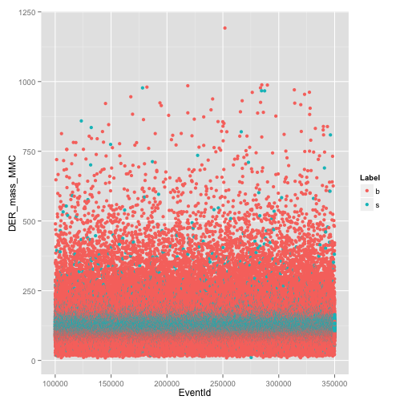

Exploratory Figures for Higgs Boson Challenge
========================================================

```r
train <- read.csv("../data/processed/processed_train.csv")
```


```r
library(ggplot2)
vars <- names(train)[2:31]
for (v in vars) {
    d <- which(train[, v] != -999)
    f <- train[d, ]
    p <- ggplot(f, aes(x = EventId, y = f[, v], color = Label), environment = environment())
    l <- p + labs(y = v)
    print(l + geom_point())
}
```

                              


